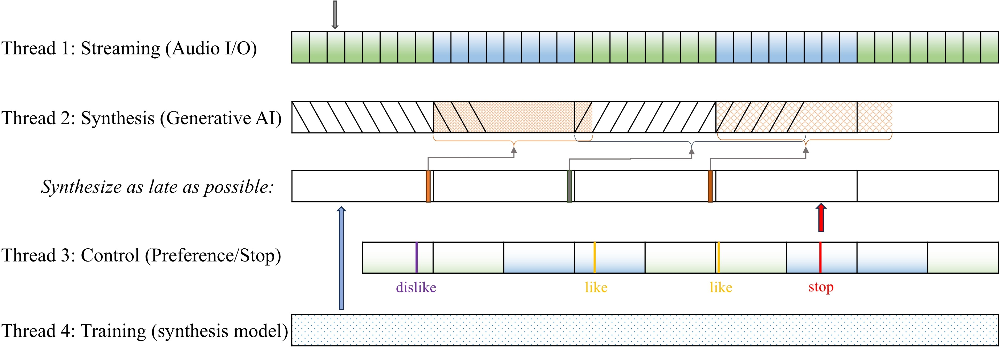
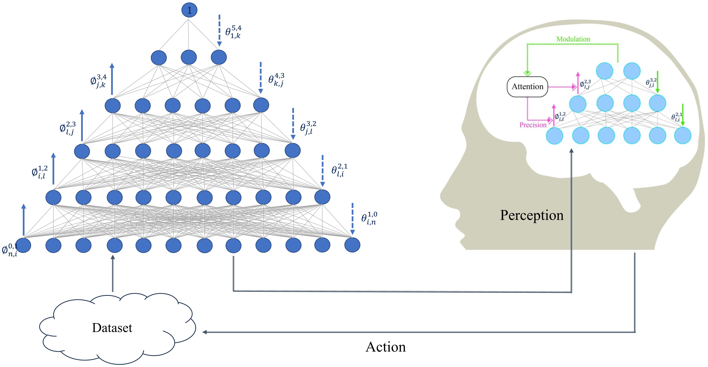

# Helmholtz-Drum-Machine
Real-time Music-generating User-computer Interactive Helmholtz Machine [[Watch the demo video on Youtube](https://www.youtube.com/watch?v=Poai3rMIy30&list=PLWSd-mlbNCAWjovFmisi1asUd0StPzdPc)]

This repository records an application that performs real-time machine-learning-based music generating, synthesizing, streaming, and training in Python. The generative model is the Helmholtz machine, and the generated music is percussive drum patterns. The real-time training is instructed by user preference based on-line data construction. The multi-processing real-time system is realized by `threading` in Python.

*Note*: this work is included in the author's Ph.D. qualification writing [Studies based on the Helmholtz Machine](https://drive.google.com/file/d/1CNLO2FjDNW5RT0Zfc70ynZeVdm-KQsTH/view?pli=1), Chapter 4.

## Real-time Multi-processing Interactive System

There are 4 threads in the multi-processing system:

- Thread 1: Streaming. Real-time audio streaming under PyAudio's audio I/O system. Two alternative buffers to write synthesized audio.

- Thread 2: Synthesis. Sample from the Helmholtz machine to synthesize the next drum audio. A bywork is to update the progress bar.

- Thread 3: User control: the user has 3 types of control: like (1 or l), dislike (2 or d), stop (0 or s). The timing of liking/disliking a sample is shifted backwards half of a buffer length. Stop is to terminate the real-time streaming.

- Thread 4: Training: Training of the neural network with real-time user-constructed datasets by active sampling. A bywork is to plot the data and generative distribution after several epochs.

<caption>
 Figure 1: Thread-based Multi-processing System for Real-time Audio Streaming, Synthesis, and User-interactive Neural Network Training. 
</caption>

## Action-Perception Loop

The real-time training based on user preference is a typical HCI (Human-Computer Interaction) system. The interaction depicted in Fig. 2 can be interpreted under various models such as TTOM (thinking through other minds) [[paper](https://sandervandecruys.be/pdf/2020_VandeCruysHeylighenBBS_Dark_side.pdf)], active inference of communication [[paper](https://www.sciencedirect.com/science/article/pii/S0149763420304668?via%3Dihub)], emotional inference devices [[paper](https://www.frontiersin.org/journals/computational-neuroscience/articles/10.3389/fncom.2020.00030/full)], agent-environment system [[paper](https://www.sciencedirect.com/science/article/pii/S0022519318303151)] and niche construction [[paper](https://royalsocietypublishing.org/doi/pdf/10.1098/rsif.2017.0685)]. Here we could model the agent's brain using another Helmholtz machine (please refer to [Chapter 3](https://drive.google.com/file/d/1CNLO2FjDNW5RT0Zfc70ynZeVdm-KQsTH/view?pli=1) for the Helmholtz neural machine). If the action-perception loop runs between two Helmholtz machines, it's a computer-computer interactive system. If we have a real agent controlling the interface, it's a HCI system as depicted here.

<caption>
 Figure 2: Communication between Two Helmholtz Machines via Action-Perception Loop. The Helmholtz machines can be artificial (simulated by computer) or neuronal (hierarchical cortical responses).
</caption>

The reciprocal loop of communicative exchanges are realized by two agents' *inferring each other*, decomposed as below:

- User's action (explicit): active niche construction. Modified data distribution by user preference selection.
- Machine's perception (explicit): training of the Helmholtz machine. Optimize model representations to approximate the data distribution.
- Machine's action (implicit): generated samples of the Helmholtz machine. The outputs screened by the user potentially act on the user's internal models.
- User's perception (implicit): the user's perception or expectation is subject to machine generations. User's ears might get used to the surprising patterns after long enough time.
